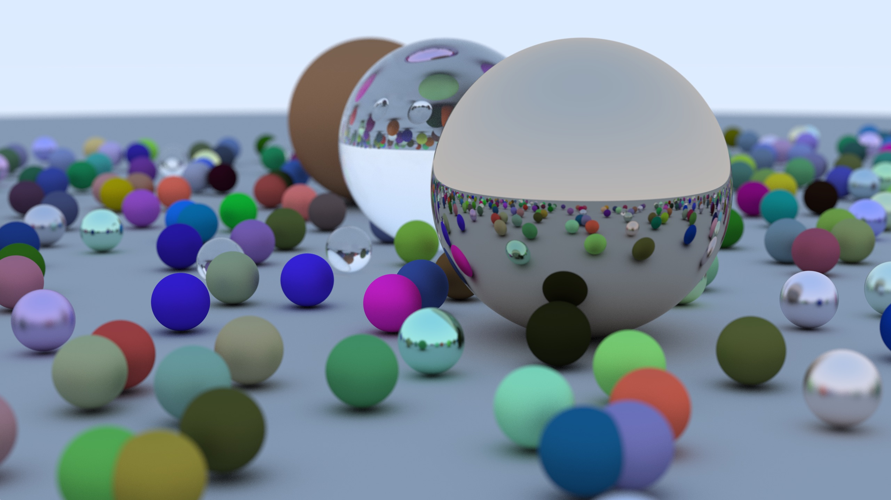

# RayTracer

라이브러리 없이 순수 C++로 만든 레이트레이서입니다. 공부 목적으로 1주일간 작업했습니다.

참고 문헌: <http://www.realtimerendering.com/raytracing/Ray%20Tracing%20in%20a%20Weekend.pdf>

블로그: <https://othereum.github.io/c++/ray-tracer>

